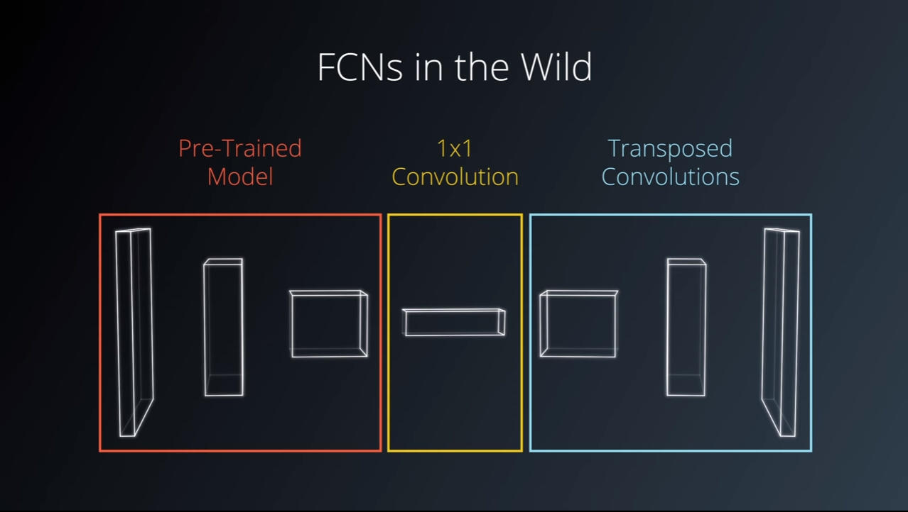
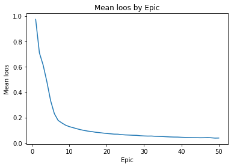
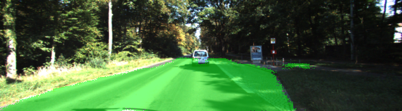
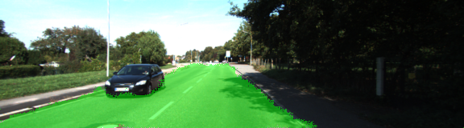
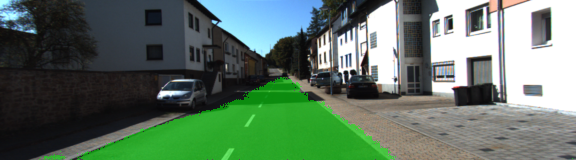
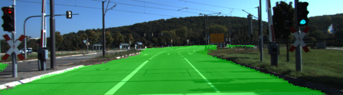

# Semantic Segmentation
## 1. Introduction
In this project the pixels of a road in images are labelled using a Fully Convolutional Network (FCN).
The network uses the architecture described in [Long et al.](https://people.eecs.berkeley.edu/~jonlong/long_shelhamer_fcn.pdf)
and is trained on the [Kitti Road dataset](http://www.cvlibs.net/datasets/kitti/eval_road.php).


## 2. Setup
### Frameworks and Packages
Make sure you have the following is installed:
 - [Python 3](https://www.python.org/)
 - [TensorFlow](https://www.tensorflow.org/)
 - [NumPy](http://www.numpy.org/)
 - [SciPy](https://www.scipy.org/)
### Dataset
This benchmark has been created in collaboration with Jannik Fritsch and Tobias Kuehnl from [Honda Research Institute Europe GmbH](http://www.honda-ri.de/tiki-index.php?page=Welcome). The road and lane estimation benchmark consists of 289 training and 290 test images. It contains three different categories of road scenes:
- uu - urban unmarked (98/100)
- um - urban marked (95/96)
- umm - urban multiple marked lanes (96/94)
- urban - combination of the three above

### Frameworks and Packages
Make sure you have the following is installed:
 - [Python 3](https://www.python.org/)
 - [TensorFlow](https://www.tensorflow.org/)
 - [NumPy](http://www.numpy.org/)
 - [SciPy](https://www.scipy.org/)


### Run
Run the following command to run the project:
```
python main.py
```
---

## 3. Approach

### Fully Convolutional Networks (FCN)
An FCN was used in this project because it retains the spatial information during training. This can be really helpful when trying to identify where an object is in an image. The architecture used in this project is divided into three main parts as shown in the architecture below:

1- Encoder: Pre-trained VGG16 neural network
2- 1 x 1 convolution
3- Decoder: Transposed convolutions and skip connections



### Implementation
A pre-trained VGG-16 network was converted to a fully convolutional network by converting the final fully connected layer to a 1x1 convolution and setting the depth equal to the number of desired classes (in this case, two: road and not-road). Performance is improved through the use of skip connections, performing 1x1 convolutions on previous VGG layers and adding them element-wise to upsampled (through transposed convolution) lower-level layers . Each convolution and transpose convolution layer includes a kernel initializer and regularizer

- One convolutional layer with kernel 1 from VGG's layer 7 
- One deconvolutional layer with kernel 4 and stride 2 from the first convolutional layer 
- One convolutional layer with kernel 1 from VGG's layer 4 
- The two layers above are added to create the first skip layer 
- One deconvolutional layer with kernel 4 and stride 2 from the first ship layer
- One convolutional layer with kernel 1 from VGG's layer 3 
- The two layers above are added to create the second skip layer 
- One deconvolutional layer with kernel 16 and stride 8 from the second skip layer 

### Optimizer

The loss function for the network is cross-entropy, and an Adam optimizer is used.

### Training

The hyperparameters used for training are:

  - classes = 2
  - keep_prob: 0.5
  - learning_rate: 0.00001
  - epochs: 50
  - batch_size: 5
  
  ---

## 4. Results

The grapi and videos ar generate by a jupiter notebuck named Visualisation.ipynb

### Looses over time
On average, the model decreases loss over time. This indicates the training worked correctly.
The used data are extracted from /results/1520108488.8096638/console.log



### Result video


### Example Result images






---

## 5. Improvements

The amount and quality of the traning images has a big influence on the result. 
### Augment Images
To rise the trainingdata it is possible to create aditional imagesfrom the original testdata, like
 
* Normalisation, Fliped, Brightness, Sharing, Shadowing
* Work on other colorspaces like HLS etc
* Work with thresholded binary images

### Train Inference 
It is possible to get aditional data form other sources like  the cityscapes dataset  https://www.cityscapes-dataset.com/ . It take quite some recources ( On a GPU with at least 10 teraFLOPS)

### Use Keras
For a easier handling it could be an improvement to use keras. augmentation batching and documentation comes ot of the box.
